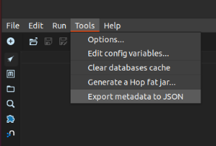
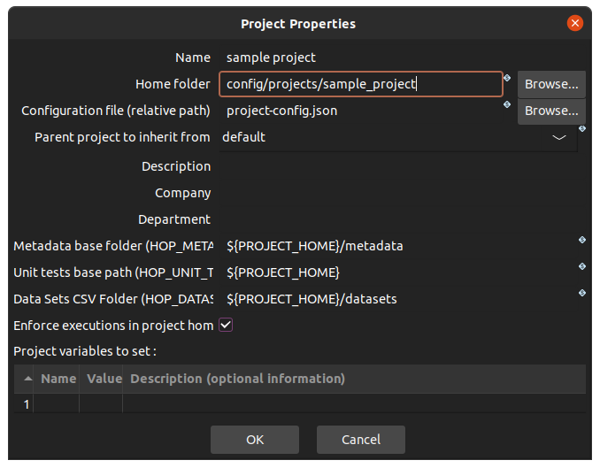

# Airflow-Hop plugin

This is an Apache Hop pluguin for Apache Airfow in ordred to orquestate Apache Hop pipelines and workflows from Airflow.

## Set up guide
The following content will be a how to set up the plugin plus some requirements and restraints when it comes to its usage.

### 1. Install the plugin
The first step in order to get this plugin working is to download the repository using the following command:
```
python -m pip install git+https://github.com/damavis/airflow-hop-plugin.git@b1ed765c7d52e195b26e45c4a721a47f448aa6ab
```

### 2. Generate metadata.json
For the correct configuration of this plugin a file containing all Hop's metadata must be created inside the project's directory. This can be done by exporting it from Hop itself.

Please note that this process must be repeated each time the metadata of a project is modified.



### 3. Hop Directory Structure
It's really important for the Hop home directory to have the following structure.
```
hop # This is the hop home directory
├── ...
├── config
│   ├── hop-config.json
│   ├── example_environment.json # This is where you should save your environment files
│   ├── metadata
│   │   └── ...
│   └── projects
│       ├── ...
│       └── example_project # This is how your project's directory should look
│           ├── metadata.json
│           ├── metadata
│           │   └── ...
│           ├── example_directory
│           │   └── example_workflow.hwl
│           └── example_pipeline.hpl
├── ...
```

Moreover, please remember to save all projects inside the "projects" directroy and set a path relative to the hop home directory when configuring them like shown in the following picture:



### 4. Creating a DAG
Here's an example of a DAG:

```python
from airflow_hop.operators import HopPipelineOperator
from airflow_hop.operators import HopWorkflowOperator

# ... #

with DAG('sample_dag', start_date=datetime(2022,7,26),
        schedule_interval='@daily', catchup=False) as dag:

    # Define a pipeline
    first_pipe = HopPipelineOperator(
        task_id='first_pipe',
        pipeline='pipelines/first_pipeline.hpl',
        pipe_config='remote hop server',
        project_name='default',
        log_level='Basic')

    # Define a pipeline with parameters
    second_pipe = HopPipelineOperator(
        task_id='second_pipe',
        pipeline='pipelines/second_pipeline.hpl',
        pipe_config='remote hop server',
        project_name='default',
        log_level='Basic',
        params={'DATE':'{{ ds }}'}) # Date in yyyy-mm-dd format

    # Define a workflow with parameters
    work_test = HopWorkflowOperator(
        task_id='work_test',
        workflow='workflows/workflow_example.hwf',
        project_name='default',
        log_level='Basic',
        params={'DATE':'{{ ds }}'}) # Date in yyyy-mm-dd format

    first_pipe >> second_pipe >> work_test
```

It's important to point out that both the workflow and pipeline parameters must be a relative path parting from the project's directory.

### 5. Create an Airflow Connection
To correctly use the operators you must create a new [Airflow connection](https://airflow.apache.org/docs/apache-airflow/stable/howto/connection.html). There are multiple ways to do so and whichever you want can be used, but it should have these values for the following attributes:

- Connection ID: 'hop_default'
- Connection Type: 'hop'
- Login: your_login
- Password: your_password
- Host: your_host
- Port: your_port
- Extra: "hop_home": "path_to_your_hop_home_directory"

 Example of a new Airflow connection using Airflow's CLI:
```
airflow connections add 'hop_default' \
    --conn-json '{
        "conn_type": "hop",
        "login": "login",
        "password": "password",
        "host": "example_host",
        "port": port,
        "schema": "",
        "extra": {
            "hop_home": "/home/user/hop"
        }
    }'
```

## Development

### Create a Docker Hop Server
(For this [Docker](https://docs.docker.com/engine/install/) must be downloaded)

To correctly execute Hop workflows and pipelines you should use a Hop Server.

If you want to use Docker to create the server you can use the following docker-compose configuration as a template:
```yaml
services:
  apache-hop:
    image: apache/hop:latest
    ports:
      - port:port
    volumes:
      - hop_path:/home/hop
    environment:
      HOP_SERVER_USER: username
      HOP_SERVER_PASS: password
      HOP_SERVER_PORT: port
      HOP_SERVER_HOSTNAME: hostname
```
Once done, the Hop server can be started using docker compose.
